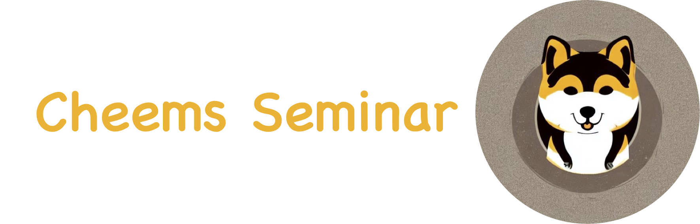

<p align="center" width="100%">
<a href="https://github.com/Cheems-Seminar/segment-anything-and-name-it" target="_blank"></a>
</p>

# Grounded Segment Anything: From Objects to Parts


In this repo, we expand [Segment Anything Model](https://segment-anything.com/) (SAM) to support text prompt input. The text prompt could be object-level (eg, dog) and part-level (eg, dog head). Furthermore，we build a [Visual ChatGPT](https://github.com/microsoft/visual-chatgpt)-based dialogue system that flexibly calls various segmentation models when receiving instructions in the form of natural language.


## :sparkles::sparkles: Highlights :sparkles::sparkles:

- Grounded segment anything at both object level and ***part*** level.
- Integrate with [Visual ChatGPT](https://github.com/microsoft/visual-chatgpt) :robot::speech_balloon:.


## Model Summary


| Model | Function |
| ----  | -------- |
| [Segment Anything](https://github.com/facebookresearch/segment-anything) | Segment anything from prompt |
| [GLIP](https://github.com/microsoft/GLIP) | Grounded language-image pre-training |
| [Visual ChatGPT](https://github.com/microsoft/visual-chatgpt) | Connects ChatGPT and segmentation foundation models |
| :star:**VLPart**:star: (*under review*) | Going denser with open-vocabulary part segmentation |

## Usage

### Install

See [installation instructions](INSTALL.md).


### :robot::speech_balloon: Integration with Visual ChatGPT

```bash
# prepare your private OpenAI key (for Linux)
export OPENAI_API_KEY={Your_Private_Openai_Key}
python chatbot.py --load "ImageCaptioning_cuda:0, SegmentAnything_cuda:1, PartPromptSegmentAnything_cuda:1, ObjectPromptSegmentAnything_cuda:0"
```


### :last_quarter_moon: Prompt Segment Anything at Part Level

```bash

wget https://github.com/Cheems-Seminar/segment-anything-and-name-it/releases/download/v1.0/swinbase_part_0a0000.pth
wget https://dl.fbaipublicfiles.com/segment_anything/sam_vit_h_4b8939.pth

python demo_vlpart_sam.py --input_image assets/twodogs.jpeg --output_dir outputs_demo --text_prompt "dog head"
```
Result:


### :full_moon: Prompt Segment Anything at Object Level

```bash
wget https://github.com/Cheems-Seminar/segment-anything-and-name-it/releases/download/v1.0/glip_large.pth

python demo_glip_sam.py --input_image assets/demo2.jpeg --output_dir outputs_demo --text_prompt "frog"

```

Result:


###  :lollipop: Multi-Prompt

For multiple prompts, seperate each prompt with `.`, for example, `--text_prompt "dog head. dog nose"`


### Model Checkpoints

* [ViT-H SAM model](https://dl.fbaipublicfiles.com/segment_anything/sam_vit_h_4b8939.pth)
* [VLPart Swin-Base](https://github.com/Cheems-Seminar/segment-anything-and-name-it/releases/download/v1.0/swinbase_part_0a0000.pth)
* [GLIP Swin-Large](https://github.com/Cheems-Seminar/segment-anything-and-name-it/releases/download/v1.0/glip_large.pth)


## License

This project is under the CC-BY-NC 4.0 license. See [LICENSE](LICENSE) for details.


## Acknowledgement

A large part of the code is borrowed from [segment-anything](https://github.com/facebookresearch/segment-anything), [CLIP](https://github.com/openai/CLIP), [GLIP](https://github.com/microsoft/GLIP), [Grounded-Segment-Anything](https://github.com/IDEA-Research/Grounded-Segment-Anything), [Visual ChatGPT](https://github.com/microsoft/visual-chatgpt). Many thanks for their wonderful works.


## Citation
If you find this project helpful for your research, please consider citing the following BibTeX entry.
```BibTeX
@misc{segrec2023,
  title =        {Grounded Segment Anything: From Objects to Parts},
  author =       {Sun, Peize and Chen, Shoufa and Luo, Ping},
  howpublished = {\url{https://github.com/Cheems-Seminar/segment-anything-and-name-it}},
  year =         {2023}
}

@article{vlpart2023,
  title   =  {Going Denser with Open-Vocabulary Part Segmentation},
  author  =  {Sun, Peize and Chen, Shoufa and Zhu, Chenchen and Xiao, Fanyi and Luo, Ping and Xie, Saining and Yan, Zhicheng},
  journal =  {Under Review},
  year    =  {2023}
}
```